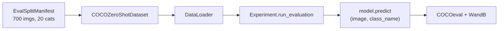
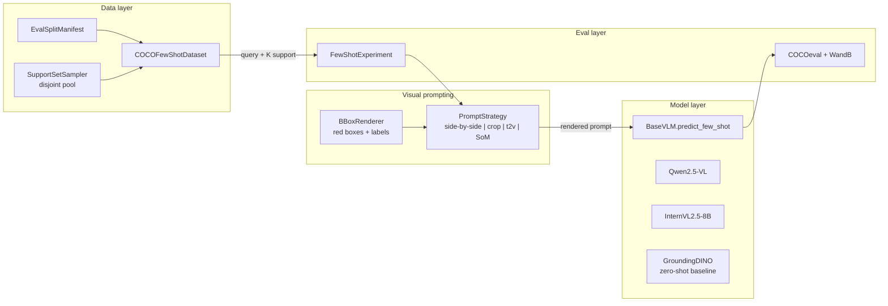
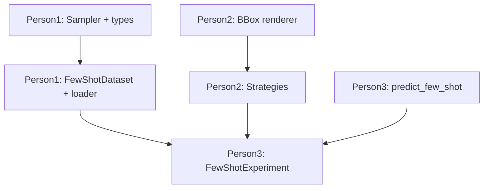

# Few-shot ICL pipeline — roadmap (Task 2)

Living document: track progress here. **This file describes what to build; implementation is not done yet.**

Goal: extend the existing **zero-shot** COCO eval pipeline toward **in-context / few-shot detection** (Task 2 in `project-desc.md`): K support images with bounding-box overlays, multiple prompt strategies, compare to zero-shot VLM and Grounding DINO.

---

## Current state (already in repo)

End-to-end **Task 1 (zero-shot)**:



| Piece | Location |
|-------|----------|
| Eval split manifest | `data/eval_split.py`, `data/splits/*.json` |
| Zero-shot dataset | `data/datasets.py` — `COCOZeroShotDataset` |
| Loader | `data/dataloaders.py` — `get_coco_dataloader` |
| Base VLM API | `models/base_vlm.py` — `predict(image, class_name, w, h)` |
| Models | `models/qwen.py`, `models/internVL.py`, `models/grounding_dino.py` |
| Eval loop | `pipeline.py` — `Experiment` |
| Novel 20 / base 60 | `data/coco_categories.py` |

---

## Target architecture (Task 2)



---

## Next steps (small chunks)

### Progress checklist (implementation status)

- [x] **A. Support pool and sampling** — `SupportExample` + `SupportSetSampler` with disjoint support pools and deterministic sampling.
- [x] **B. Bounding boxes on images** — `render_bboxes` implemented with optional numbered labels.
- [x] **C. Few-shot dataset and loader** — `COCOFewShotDataset` + `get_coco_few_shot_dataloader`.
- [x] **D. Prompt package scaffold** — `prompts/` package with four strategy modules and strategy registry.
- [x] **E. Model API extension** — `BaseVLM.predict_few_shot` and multi-image paths in Qwen/InternVL.
- [x] **F. Evaluation + entry wiring** — `FewShotExperiment`, config knobs, and `main.py` mode switch.
- [~] **D/E strategy fidelity gaps** — `text_from_vision` is currently single-pass prompting (not full two-pass describe→detect yet), and `set_of_mark` does not yet implement query-region proposal/index selection.
- [ ] **Experiments + reporting** — run 1-shot/5-shot sweeps and document comparative metrics vs zero-shot baselines.

### A. Support pool and sampling

1. Define a **`SupportExample`** dataclass: `image_id`, PIL `image`, list of COCO-format bboxes for the target class, `category_id`, optional `class_name`.
2. Implement **`SupportSetSampler`** (`data/support_sampler.py`):
   - Load COCO from the same `ann_file` as eval.
   - Build **per-category** lists of `image_id`s that contain that category.
   - **Exclude** all `image_id`s in the eval manifest so support never overlaps query images.
   - `sample(cat_id, k)` returns K examples (deterministic seed, e.g. per-category or global seed documented in README).

**Example idea:** For `cat_id` = dog, pool = val images with at least one dog annotation minus eval image IDs; shuffle with seed 42; take first K.

### B. Bounding boxes on images (visual prompting)

3. Implement **`render_bboxes`** in `data/visual_prompt.py` (PIL `ImageDraw`):
   - Input: RGB image, list of `[x, y, w, h]` COCO boxes, color, line width, optional numbered labels `"1"`, `"2"`, …
   - Output: **new** PIL image (do not mutate original).

**Example idea:** One red rectangle per box; top-left label with small filled rectangle for readability.

### C. Few-shot dataset and loader

4. Add **`COCOFewShotDataset`** next to `COCOZeroShotDataset` in `data/datasets.py`:
   - Same query indexing as today (`image_ids`, `eval_cat_ids`, manifest).
   - For each query item and each **present** target category, attach K support examples from the sampler.

5. Add **`get_coco_few_shot_dataloader(k_shot, ...)`** in `data/dataloaders.py` wiring manifest + sampler + dataset.

**Example return shape (conceptual):**

```python
{
    "image_id": ...,
    "image": query_pil,
    "width": ...,
    "height": ...,
    "targets": [...],  # as today
    "support_by_cat": {
        17: [SupportExample, SupportExample, ...],  # K items for category_id 17
    },
}
```

### D. Prompt strategies

6. Create package **`prompts/`** with abstract **`PromptStrategy`**:
   - Method like `build_prompt(query_image, support_by_cat, class_name, cat_id) -> dict` with keys such as `images` (list of PIL), `text` (str), or strategy-specific extras.

7. Implement four strategies (can be separate files):

| Strategy | Idea |
|----------|------|
| **Side-by-side** | Annotated support image(s) as separate images + query image; text: e.g. “Examples show {class} in red boxes. Detect all {class} in the **last** image.” |
| **Cropped exemplars** | Crop each GT box from support images; pass crops + query; text describes crops as examples. |
| **Text-from-vision** | **Two calls:** (1) VLM describes object from support images; (2) detect in query using that description as text (or combined prompt). |
| **Set-of-mark** | Propose regions on query (e.g. from Grounding DINO with a broad prompt), number them; VLM picks indices that match support concept. |

### E. Model API and inference

8. Extend **`BaseVLM`** with **`predict_few_shot(query_image, support_images, prompt_text, img_w, img_h)`** returning COCO-format boxes for the **query** image.

9. **Qwen2.5-VL:** build multi-image chat `messages` with several `{"type": "image"}` entries + final text instruction (see existing `predict` in `qwen.py`).

10. **InternVL2.5-8B:** extend `chat` path to accept multiple image tensors or multiple tiles per image — align with InternVL docs for multi-image grounding.

11. **Grounding DINO:** keep **only** `predict` (text-only baseline); no few-shot multi-image.

### F. Evaluation pipeline

12. Add **`FewShotExperiment`** in `pipeline.py` (or `pipeline_few_shot.py`):
    - Loop: for each batch item, for each `(cat_id, class_name)`, build prompt via strategy → `predict_few_shot` → append detections to COCO JSON (same structure as today).
    - Reuse **`COCOeval`** + manifest `imgIds` / `catIds` like `Experiment._calculate_and_log_metrics`.

13. **`config.py`:** add settings e.g. `k_shot`, `prompt_strategy` name, optional second-pass flags for text-from-vision.

14. **`main.py`:** entry that selects zero-shot vs few-shot experiment (env or CLI later).

---

## File change checklist (when you implement)

| Action | File |
|--------|------|
| NEW | `data/support_sampler.py` |
| NEW | `data/visual_prompt.py` |
| NEW | `prompts/__init__.py` |
| NEW | `prompts/base_strategy.py` |
| NEW | `prompts/side_by_side.py` |
| NEW | `prompts/cropped_exemplars.py` |
| NEW | `prompts/text_from_vision.py` |
| NEW | `prompts/set_of_mark.py` |
| EDIT | `data/datasets.py` — `COCOFewShotDataset` |
| EDIT | `data/dataloaders.py` — few-shot factory |
| EDIT | `models/base_vlm.py` — `predict_few_shot` |
| EDIT | `models/qwen.py`, `models/internVL.py` — multi-image |
| EDIT | `pipeline.py` — `FewShotExperiment` |
| EDIT | `config.py` — few-shot settings |
| EDIT | `main.py` — optional few-shot entry |

---

## Team split (3 people) — assign names later

Roughly equal surface area; adjust after you pick who does what.

### Person 1 — Data loading and support pool

| Step | Task |
|------|------|
| 1 | `SupportExample` dataclass + `SupportSetSampler` with disjoint pools from val minus eval manifest |
| 2 | `COCOFewShotDataset` + wire manifest / `eval_cat_ids` like zero-shot |
| 3 | `get_coco_few_shot_dataloader` + document seeds and `.env` vars |
| 4 | Sanity script or notebook snippet: print one query + K supports for one category |

**Depends on:** existing `eval_split.py`, `build_eval_split.py`, `coco_categories.py`.

---

### Person 2 — Visual rendering and prompt strategies

| Step | Task |
|------|------|
| 1 | `render_bboxes` (+ optional label numbering) in `visual_prompt.py` |
| 2 | `PromptStrategy` ABC in `prompts/base_strategy.py` |
| 3 | Implement **side_by_side** and **cropped_exemplars** (use renderer) |
| 4 | Implement **text_from_vision** (interface: may call model twice — coordinate with Person 3) |
| 5 | Implement **set_of_mark** (needs region proposals — likely Grounding DINO helper; coordinate with Person 3) |

**Depends on:** Person 1’s output types (`SupportExample`, dataset dict) — can mock with fake images until ready.

---

### Person 3 — Models, few-shot inference, eval glue

| Step | Task |
|------|------|
| 1 | `predict_few_shot` on `BaseVLM`; implement in **Qwen** and **InternVL** |
| 2 | Optional: small helper for **Grounding DINO** proposals for SoM strategy |
| 3 | `FewShotExperiment`: loop dataset → strategy → `predict_few_shot` → COCO JSON |
| 4 | WandB tags: `k_shot`, `prompt_strategy`, `model_name` |
| 5 | `main.py` / config switch: zero-shot vs few-shot |

**Depends on:** strategy interface (Person 2); dataset iterator (Person 1). Can stub strategy with a single “concat images” prompt for integration tests.

---

## Dependency order



- All three can start **in parallel** on foundations (P1 sampler types, P2 PIL drawing, P3 abstract method + Qwen multi-image spike).
- **Integration** needs: dataset dict + strategy output + `predict_few_shot` — schedule a short sync when Person 1 has stable shapes and Person 2 has the ABC.

---

## References in repo

- Project tasks: `../project-desc.md`
- Eval split schema: `data/splits/README.md`
- Build eval split: `scripts/build_eval_split.py`

---

*Last updated: roadmap file created for team tracking; implementation pending.*
